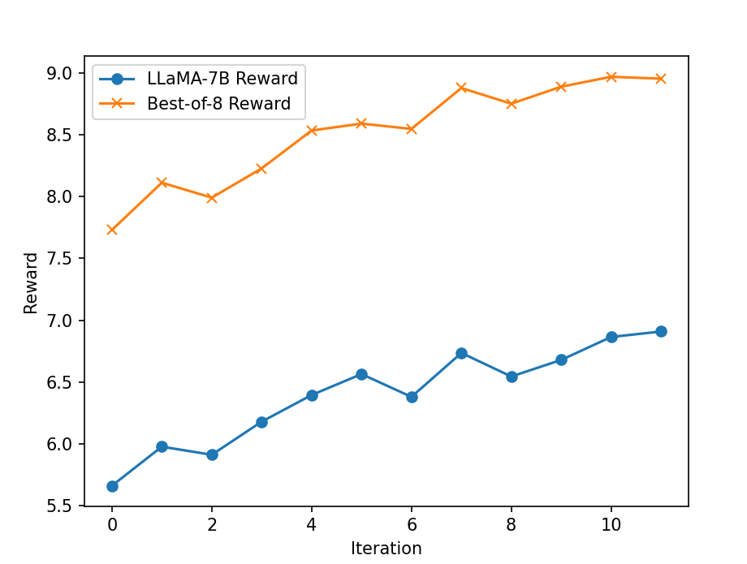

<p align="center" width="100%">

</p>

# LMFlow-RAFT

This is a sub branch of LMFlow, used to present an implementation of RAFT with separate stages, in the sense that we will implement inference, reward ranking, and finetuning separately, so that as long as you can finetune the model, you might leverage RAFT to align your model.


<p align="center" width="100%">

</p>

## Quick Start

### Setup

```bash
git clone -b raft_dev https://github.com/WeiXiongUST/LMFlow_RAFT_Dev.git
cd LMFlow
conda create -n lmflow python=3.9 -y
conda activate lmflow
conda install mpi4py
./install.sh
```

For all the scripts, you may need to run the following command before you run it.

```bash
chmod u+x Address_of_script
```

If you want to develop the code by yourself, you can visit ./src/lmflow/pipeline/raft_aligner.py. Moreover, you should setup your wandb account first before runing any tuning scripts.

### Prepare Dataset
We have prepared the HH-RLHF dataset and preprocess it into SFT, RM, and RLHF datasets. You can download them by running 

```bash
cd data
./download.sh hh_rlhf
```

Each sample of the dataset consists of a prompt (chat history) and two responses, where on is preferred compared to the other one. An example of the dataset is

**###Human**: How can I get my girlfriend to cook more?
**###Assistant**: Have you tried reminding her of how nice the food tastes?
**###Human**: I could do it more.
**###Assistant**:

**Responses**:
- Preferred $y_w$: That might work.  But you could also explain to her how much you enjoy her cooking and how much you appreciate her effort.  Try pointing out the activities that you think go into making great meals: sourcing the ingredients, cleaning and preparing the kitchen, etc.
- Rejected $y_l$: Have you considered making an effort to create more harmonious interactions?

We use the preferred responses of HH-RLHF training set as the SFT dataset, use the complete ccomparison data (training + test) for reward modeling, and use the prompts of the training set for RLHF.

## RLHF Pipeline
The complete pipeline includes 1） SFT, 2) Reward modeling, and 3) RLHF. 

### 1 SFT

We use the open llama 7b as an example. You can conduct finetuning via the following command：

```bash
./scripts/finetune.sh openlm-research/open_llama_7b ./output_models/sft_open_llama7b ./data/hh_rlhf/sft
```

Here, the first parameter openlm-research/open_llama_7b is the starting checkpoint, the second parameter ./output_models/sft_open_llama7b is the output dir, and the last parameter is the path of dataset. You can also change the learning rate, batch size by modifying ./scripts/finetune.sh.

If you encounter an error related to `utf-8`, you may need to delete the ._hh_rlhf_sft_data (also for the rm data and rlhf data) first...


### 2 RAFT ALIGNMENT
We skip the reward modeling first and present an overview of the reward modeling later. To run RAFT, we should first modify scripts/run_raft_align.sh including
- The number of total iterations: raft_num_iteration=20;
- The base dir of the experiment used to store all the intermediate models and data: base_dir="/home/usr/raft/LMFlow_RAFT_Dev/output_models/raft_test"
- The starting checkpoint: sft_model="./output_models/sft_open_llama7b"
- The reward model used for RLHF: reward_model="weqweasdas/hh_rlhf_rm_open_llama_3b".

You should modify the base dir and starting checkpoint according to your customized needs. The reward model is based on open-llama-3b, which is trained on the HH-RLHF dataset and has been uploaded to huggingface for your convenience but you can definitely use your own reward model.

Then, we simply run the following script 
```bash
./scripts/run_raft_align.sh
```

The script will iteratively call several sub-scripts to collect new data, rank samples beased on reward, and finetune on the filtered dataset. Specifically, 

- Inference: ./scripts/infer_get_samples.sh A B C
  - parameter A: the model used to collect new data;
  - parameter B: the global iteration id in \{0, 1, ..., raft_num_iteration\}, please do not modify this parameter;
  - parameter C: the dir to save the collected dataset.
- Reward ranking: ./scripts/infer_get_rewards.sh A B C D
  - parameter A: the collected dataset in the inference stage;
  - parameter B: the dir to save the filtered dataset;
  - parameter C: the base dir of the experiment, used to record reward;
  - parameter D: reward model.
- Finetuning: ./scripts/finetune.sh A B C
  - parameter A: the model to be trained;
  - parameter B: the dir to save the trained model;
  - parameter C: the filtered dataset from the reward ranking stage.
We have set these parameters appropriately so that RAFT will store all the intermediate files in your base dir.


#### 2.1 More hyper-parameters

For collecting new data (infer_get_samples.sh), there are several useful parameters to be tuned.

- dataset_path, which is the prompt set;
- raft_batch_size, which is the number of samples collected for one time;
- the maximal new token will be sampled uniformly from [output_min_length output_max_length]
- output_temperature, which is the sampling temperature, a high temperature leads to more diverse output;
- top_reward_percentage, where we will sample int(1/top_reward_percentage) responses for each prompt and take the one with the highest reward;
- inference_batch_size_per_device, we use batch inference to accelerate data collection;

For model finetuning (finetune.sh), the parameters can be understood from their names. In particular, the overall batch size = num_gpu * per_device_train_batch_size * gradient_accumulation_steps

- num_train_epochs;
- learning_rate;
- per_device_train_batch_size;
- gradient_accumulation_steps


### 3 Reward Modeling

To model a reward model, you should first finetune the base model as in the first step. Suppose that we have obtain a open-llama-3b sft model. Then, you should modify the ./scripts/run_reward_modeling.sh to set the starting checkpoint as your SFT model and the  you can run the following command to train your own reward model.

```bash
./scripts/run_reward_modeling.sh
```

You may also modify the script to change learning rate and batchsize. 

## Support

If you need any help, please submit a Github issue or contact me via wx13@illinois.edu

## License
The code included in this project is licensed under the [Apache 2.0 license](https://github.com/OptimalScale/LMFlow/blob/main/LICENSE).
If you wish to use the codes and models included in this project for commercial purposes, please sign this [document](https://docs.google.com/forms/d/e/1FAIpQLSfJYcci6cbgpIvx_Fh1xDL6pNkzsjGDH1QIcm4cYk88K2tqkw/viewform?usp=pp_url) to obtain authorization.

## Citation
If you find this repository useful, please consider giving ⭐ and citing our [paper](https://arxiv.org/abs/2306.12420):

```
@article{diao2023lmflow,
  title={Lmflow: An extensible toolkit for finetuning and inference of large foundation models},
  author={Diao, Shizhe and Pan, Rui and Dong, Hanze and Shum, Ka Shun and Zhang, Jipeng and Xiong, Wei and Zhang, Tong},
  journal={arXiv preprint arXiv:2306.12420},
  year={2023}
}
```

```
@article{dong2023raft,
  title={Raft: Reward ranked finetuning for generative foundation model alignment},
  author={Dong, Hanze and Xiong, Wei and Goyal, Deepanshu and Pan, Rui and Diao, Shizhe and Zhang, Jipeng and Shum, Kashun and Zhang, Tong},
  journal={arXiv preprint arXiv:2304.06767},
  year={2023}
}
```
